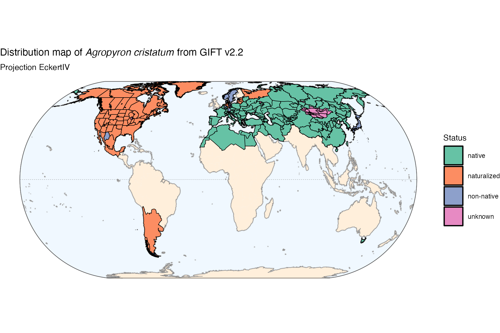
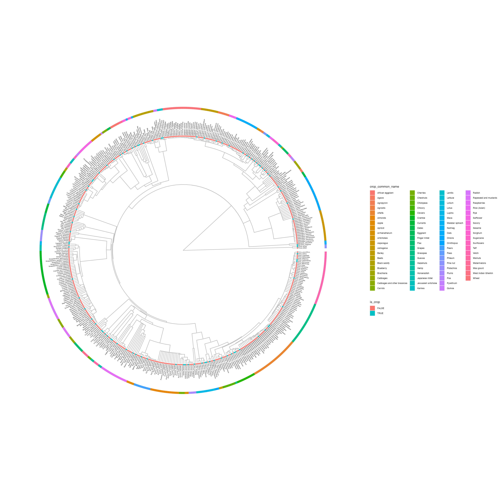

# What's where

## Taxonomy harmonisation

`"./GIFT/Outputs/Harmonise_Names.R"` is a script for harmonising species names with GIFT.

## Distribution

Maps of the distribution of the CWRs in the preliminary list of CWRs for Europe shared by Louisa (like the one below) are saved in `"./GIFT/Outputs/CWR_World_Maps"`. The code to produce them is in `"./GIFT/Code/GIFT_Sandbox.R"` with a bunch of other experimental code—I still need to clean this up.

## Phylogeny

The phylogenetic trees of CWRs and their next-of-kin crop like the one below are saved in `"./GIFT/Outputs/GIFT_Phylogeny.R"`. The code to produce them is in `"./GIFT/Code/Phylogenetic_Tree.R"` and also contains code to derive a distance matrix from phylogeny objects.

Here there is a small issue. In the phylogeny I used, there are “multiple equidistant crops” for some of the CWRs, for instance among garlics and onions Allium porrum, A. sativum, A. cepa, and A. schoenoprasum are all equidistant to all CWRs—this can be seen in the plot above. For this reason the nearest crop label to all Allium CWRs is "Onions", while "Garlic" is absent. I can solve this issue later on by listing all equidistant crops instead of only choosing the nearest one, however this would result in longer and messier labels.